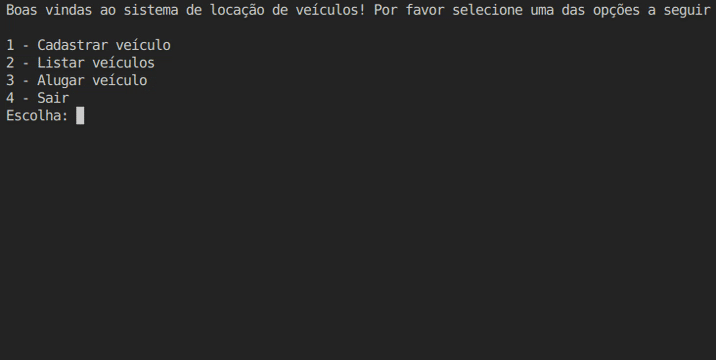
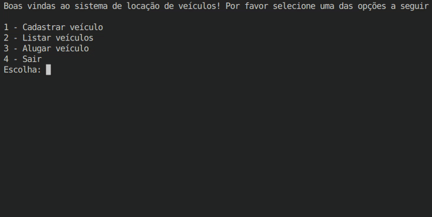
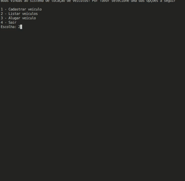

# Simulador de Locação de Veículos

## Descrição do Projeto
O projeto elaborado envolve aplicar *Domain Driven Design* (Design Orientado à Domínio ou DDD) em um sistema simples de aluguel de carros. Nesse protótipo de ferramenta, o usuário é capaz de registrar veículos e aluguéis de maneira prática, necessitando apenas fornecer identificadores (CPF para locações e placa para veículos).

Para o mantimento dos dados recebidos, o sistema conta com um banco de dados simples utilizando SQLite do próprio Python. Desse modo, os dados apenas são registrados na instância do próprio usuário, mais especificamente no arquivo `renting_service.db`.

---

## Como utilizar o sistema
Para utilizá-lo, é necessário apenas executar o arquivo `main.py`. Em seguida, o terminal mostrará um menu de múltipla escolha com todas as funções disponíveis para o usuário. Vale ressaltar que, mesmo selecionando uma opção válida, o menu será reimpresso no final para dinamismo das operações (e.g. registrar um veículo para alugar logo em seguinda). Contudo, se uma opção inválida é escolhida, acontecerá o mesmo mas de maneira direta.

### Exemplo 01: cadastro de veículos
Para o registro de veículos para serem alugados, faz-se necessário informar cinco informações:

- Marca
- Modelo
- Placa: não possui padronização automática, mas recomenda-se utilizar ABC1234 para modelo tradicional e ABC1D34 para padrão Mercosul;
- Categoria: como o projeto simula uma locadora de veículos convencionais, foi decidido utilizar apenas os três tipos mais comuns de carros (SUV, Hatch e Sedan);
- Valor diário: o valor que se paga pelo carro para cada dia alugado.

### Abaixo está como se registra um veículo no sistema:

### Exemplo 02: consulta de veículos
### Essa é a operação mais simples do menu, visto que só retorna os veículos já cadastrados. 

### Exemplo 03: aluguel de veículos
### Ao alugar um veículo, recomenda-se primeiro utilizar a função de consulta para ver a placa dos veículos do catálogo de locação Em seguida, escolha a opção 3 e informe os seguintes dados:

- Placa: conforme registrada no catálogo;
- CPF: somente números (e.g 12345678901);
- Data de início formato: YYYY-MM-DD (e.g. 2025-08-01);
- Data de término: formato YYYY-MM-DD (e.g. 2025-03-31)

---

## Arquitetura do Projeto
Devido ao design do projeto, as pastas foram organizadas dividindo a parte de infraestrutura, domínio, apps e, como extra, assets. 
### Diretório de Arquivos (em ordem de utilização)
- Infra: possui o `database_connection.py`, onde é realizada a conexão com o banco de dados em `renting_service.db` e também a criação das tabelas de locação (*rentings*) e (*vehicles*) com suas colunas. Além disso, há o `sql_repos.py` que é responsável por guardar as operações de CRUD para ambas as tabelas, empregando o trabalho realizado nos dois arquivos mencionados e, por fim, tem o arquivo de testes;

- Dominio: após a preparação do banco de dados, o fluxo segue para o domínio. Aqui comporta as entidades (`dataclasses`), as regras (resolução de conflitos entre datas e o cálculo do valor total da locação) e os serviços de `vehicles` e `rentings`. Vale ressaltar que aqui acontece a interação com o banco de dados para a criação da locação e dos veículos, utilizando os repos da infra;

- App: fachada do projeto, aqui localiza-se a síntese do domínio para ser utilizada pela interface de usuário, no caso do projeto o `main.py`;

- Assets: os arquivos desta pasta não possuem ligação com o DDD, eles servem somente para abrigar os GIFs utilizados no `README.md` na seção de "Como utilizar o sistema".

## Observações
Desde o início do desenvolvimento, o projeto conta com [um repositório no Github](https://github.com/Yuri3358/cars-renting-service). Um aspecto relevante sobre o versionamento é que, como a documentação do histórico de commits foi criada após a conclusão do projeto, não foi possivel versionar no repositório, sendo as versões do  `HISTORY.md` apenas marcações "alegóricas" das *features* relevantes implementadas no projeto com exceção da v1.0.0 na aba `Releases`.